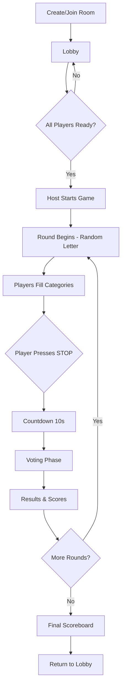

# NationsCities 🌍

**NationsCities** is a modern, real-time multiplayer web adaptation of the classic paper-and-pencil game **"Państwa-Miasta"** (known internationally as *Scattergories* or *Categories*). Built with **.NET Blazor Server** and **SignalR**, it offers a seamless, interactive gaming experience for friends to play together online.

## ✨ Features

### 🎮 Core Gameplay
- **Real-Time Multiplayer**: Instant state synchronization across all clients using SignalR
- **Dynamic Lobbies**: Create private rooms or public rooms for anyone to join
- **Customizable Gameplay**: Extensive category selection with 10 built-in categories + custom category support
- **Polish Letter Set**: Letters optimized for Polish language (excluding Q, V, X, Y and difficult diacritics)

### 📊 Scoring System
Points are awarded based on answer uniqueness and validity:

| Scenario | Points |
|----------|--------|
| **Unique correct answer** (only one correct in category) | **15 pts** |
| **Correct answer** (others also answered correctly, different answers) | **10 pts** |
| **Duplicate answer** (same answer as other players) | **5 pts** |
| **Invalid/contested/no answer** | **0 pts** |

### 🗳️ Interactive Voting Phase
After each round, players review and validate answers:
- Vote answers as **Valid**, **Invalid**, or **Duplicate**
- Consensus-based decision (majority wins)
- Disputed answers (tie votes) get 0 points

### 🛡️ Anti-Cheat System
Prevents players from leaving the game to search for answers online:

**Time Penalties (Block Duration):**
| Violation # | Block Time |
|-------------|------------|
| 1st | 2 seconds |
| 2nd | 3 seconds |
| 3rd | 5 seconds |
| 4th | 8 seconds |
| 5th+ | 13 seconds |

**Point Penalties:**
| Violation # | Penalty |
|-------------|---------|
| 1st | Warning only (0 pts) |
| 2nd | -10 pts |
| 3rd | -20 pts |
| 4th+ | -30 pts |

Penalties are displayed on the scoreboard after each round.

### 🌓 Dark & Light Theme
- Full support for both dark and light modes
- System preference detection with manual toggle
- Persistent preference saved in localStorage

### 📱 Mobile-Optimized
- Responsive design for all screen sizes
- Touch-optimized controls
- Safe area support for notched devices (iOS)

## 🛠️ Tech Stack

| Technology | Purpose |
|------------|---------|
| [.NET 10.0](https://dotnet.microsoft.com/) | Blazor Server framework |
| [SignalR](https://dotnet.microsoft.com/apps/aspnet/signalr) | Real-time WebSocket communication |
| [Tailwind CSS](https://tailwindcss.com/) | Utility-first CSS framework |
| [Material Symbols](https://fonts.google.com/icons) | Google's icon library |
| [Inter Font](https://rsms.me/inter/) | Modern UI typography |

## 🎲 Game Flow



### Round Phases:
1. **Waiting** - Waiting for host to start next round
2. **Answering** - Players type words for each category
3. **Countdown** - 10 second countdown after STOP is pressed
4. **Voting** - Players validate each other's answers
5. **Results** - Points calculated and displayed

## 📂 Project Structure

```
NationsCities/
├── Components/
│   ├── App.razor           # Root component with theme config
│   ├── Pages/
│   │   ├── Home.razor      # Landing page, create/join room
│   │   ├── Lobby.razor     # Room lobby, settings, player list
│   │   ├── GameRound.razor # Main game round screen
│   │   ├── Validation.razor # Voting phase
│   │   ├── Scoreboard.razor # Round results
│   │   └── FinalResults.razor # End game summary
│   └── Layout/
├── Hubs/
│   └── GameHub.cs          # SignalR hub for real-time events
├── Services/
│   ├── GameService.cs      # Game logic, scoring
│   └── RoomService.cs      # Room management
├── Models/
│   ├── Player.cs           # Player data (nick, score, violations)
│   ├── Room.cs             # Room state
│   ├── GameState.cs        # Current game state
│   ├── Category.cs         # Category definitions
│   ├── Violation.cs        # Anti-cheat violation tracking
│   └── Answer.cs           # Answer data structures
└── wwwroot/
    ├── app.css             # Custom CSS styles
    └── app.js              # Anti-cheat, theme, utilities
```

## 📋 Categories

### Standard Categories (10):
| Category | Icon | Polish Name |
|----------|------|-------------|
| Countries | 🏳️ | Państwa |
| Cities | 🏢 | Miasta |
| Animals | 🐾 | Zwierzęta |
| Plants | 🌿 | Rośliny |
| Names | 👤 | Imiona |
| Professions | ⚙️ | Zawody |
| Things | 📦 | Rzeczy |
| Food | 🍔 | Jedzenie |
| Movies | 🎭 | Filmy |
| Colors | 🎨 | Kolory |

**Custom Categories**: Host can add custom categories with a pencil icon.

## 🚀 Getting Started

### Prerequisites
- [.NET 10.0 SDK](https://dotnet.microsoft.com/download) (or latest preview/release)

### Installation

1. **Clone the repository**
   ```bash
   git clone https://github.com/seruss/NationsCities.git
   cd NationsCities
   ```

2. **Restore dependencies**
   ```bash
   dotnet restore
   ```

3. **Run the application**
   ```bash
   dotnet watch run
   ```

4. **Play!**
   Open your browser and navigate to `http://localhost:5229` (or the port indicated in terminal).

## 🎯 How to Play

1. **Create a Room**: Enter a nickname and start a new lobby
2. **Invite Friends**: Share the 4-letter room code or enable public room
3. **Configure Game**: Host selects categories (default: first 5) and round count
4. **Start Game**: All players must be ready, then host starts
5. **Answer Phase**: Random letter is drawn, type words for each category
6. **STOP**: Any player can press STOP to start 10s countdown
7. **Voting**: Review all answers, vote Valid/Invalid/Duplicate
8. **Score**: Points are tallied, move to next round
9. **Winner**: After all rounds, player with highest score wins!

## 🔒 Room Settings

| Setting | Default | Range |
|---------|---------|-------|
| Round Count | 10 | 1-20 |
| Round Time | 60s | ∞ (until STOP) |
| Countdown (after STOP) | 10s | Fixed |
| Voting Time | 45s | Fixed |
| Max Players | 10 | 2-10 |

## 📄 License

This project is licensed under the MIT License - see the [LICENSE](LICENSE) file for details.

---

<div align="center">
  
**Made with ❤️ in Poland 🇵🇱**

</div>
